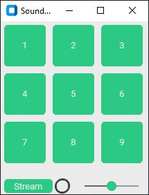
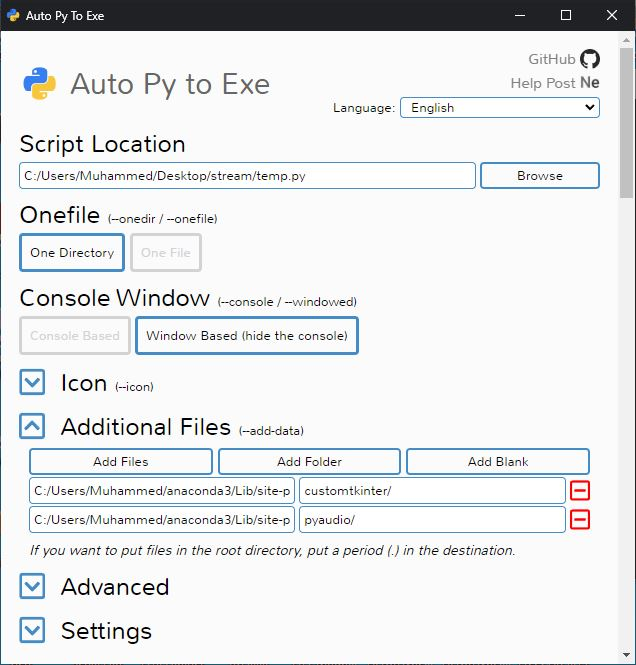

# Stream desk

 Simple sound effect board written in Python

This application is simple sound effect board.
Have a 9 sound effect and stream default input the default output the computer.
If you change the sound effects,change the mp3 files from appliacation destination

The applicaiton uses customtkinter and pygame mixer modules.

compiled projet download link:https://sourceforge.net/projects/stream-desk/

The program can be convert to exe using auto py to exe

